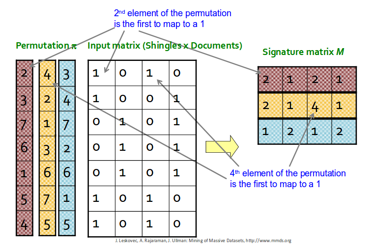

# Handling Big Data

When dealing with large datasets, consisting of billions or even trillions of records, conventional software practices fall short. Simple operations can take years to complete, and a single failure can result in significant setbacks. In this project, I leveraged a Big Data framework to process an enormous dataset and identify similar businesses.

# Introduction to a Robust Framework

The Big Data framework I employed is Apache Spark, specifically utilizing its Resilient Distributed Datasets (RDDs). Apache Spark RDDs possess the following distinctive properties:

- Distributed: RDDs are distributed across multiple nodes in a cluster, enabling parallel processing and fault tolerance.
- Resilient: RDDs are resilient to failures. If a node in the cluster fails, RDDs can be reconstructed using lineage information and data stored on other nodes.
- Partitioned: RDDs are divided into partitions, which are logical divisions of data stored on different nodes. Partitioning allows for parallel processing and distributed operations on the data.

This framework necessitated meticulous management of workers and the accumulator responsible for aggregating their operations.

# Minhashing Technique

Beyond querying the framework, I delved into more advanced algorithms such as SON and minhashing. Minhashing employs a series of hash functions to create a signature "mask," which estimates the Jaccard similarity between different reviews. This approach enabled me to process vast amounts of data within remarkably short timeframes.

# Limitations on Data Availability

Observant users may notice that the data in this GitHub repository is quite limited compared to the massive datasets I described. This discrepancy arises from the size restrictions imposed by GitHub on repository contents. Essentially, the data I worked with would not fit within the repository's storage allocation.

# Try It Yourself

To run this image compression project, please follow the steps outlined below:

- Clone the repository: git clone https://github.com/Dan-Swarts/Big_Data.git
- Install the required dependency: pip install pyspark
- Run the main compression script: python minhashing.py --input_file input.json --output_file path.json --threshold 0.4

Note that you need to provide a JSON file formatted similarly to the example input file included in this repository.